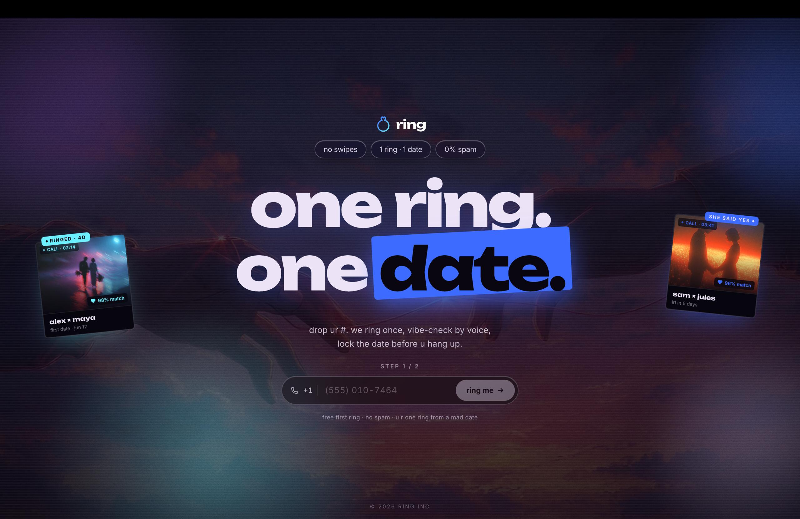

<p align="center">
  
</p>

# ring

the no-swipe dating app. drop your number, our voice AI rings you, picks a real human match by voice, and books the first date before you hang up.

---

## stack

| layer        | tool                                     |
| ------------ | ---------------------------------------- |
| framework    | Next.js 16 (App Router, RSC, `motion/react` for entrance anim) |
| language     | TypeScript                               |
| styling      | Tailwind v4 (custom theme tokens, no preprocessor) |
| db           | Postgres on Supabase (pooled via pgbouncer; direct for migrations) |
| orm          | Prisma 7 (driver adapter `@prisma/adapter-pg`) |
| auth (later) | Supabase Auth (`@supabase/ssr` already wired in `src/lib/supabase`) |
| voice AI     | [Vapi](https://vapi.ai) — outbound call places the matchmaker bot |
| email        | [Resend](https://resend.com) — transactional match-confirmation email |
| LLM          | OpenAI `gpt-5-nano` (matcher) + `text-embedding-3-small` (re-rank) |
| fonts        | Unbounded (display) + Inter (body) via `next/font` |
| deploy       | Vercel-friendly (no edge-only deps)      |

### env vars

```
DATABASE_URL                       # Supabase pooled (port 6543, ?pgbouncer=true)
DIRECT_URL                         # Supabase direct (port 5432) — used by migrations
NEXT_PUBLIC_SUPABASE_URL
NEXT_PUBLIC_SUPABASE_ANON_KEY      # publishable key
VAPI_PRIVATE_KEY
NEXT_PUBLIC_VAPI_PUBLIC_KEY
VAPI_ASSISTANT_ID
VAPI_PHONE_NUMBER_ID
VAPI_WEBHOOK_SECRET                # MUST be set — webhook fails open if empty
RESEND_API_KEY
RESEND_FROM_EMAIL
OPENAI_API_KEY
ADMIN_EMAIL                        # match results land here while in beta
```

### dev

```bash
npm install
npx prisma migrate dev          # apply schema
npm run dev                     # http://localhost:3000
```

---

## flow

```
landing form → /api/intake → Vapi outbound call → user speaks → Vapi webhook
   → Call.extracted populated → admin opens /admin → click "match" →
   /api/admin/match (matcher pipeline below) → Resend email → date locked
```

- `/api/intake` validates phone (E.164) + email, creates a `Lead` row (status `QUEUED`), and asks Vapi to dial. Beta: phone is **non-unique** so the same number can be re-tested with different emails.
- `/api/webhooks/vapi` receives `end-of-call-report`, writes the call's `transcript`, `recordingUrl`, and structured `extracted` profile, flips the lead to `COMPLETED`.
- `/admin` shows the most recent **completed call with usable extracted data** (sorted by `Call.endedAt`, not lead intake time — so it's always genuinely "the latest call"). One button: `match {name} now`.

---

## how matching works

The matcher in [src/lib/matching.ts](src/lib/matching.ts) is a **4-stage funnel**, designed so the LLM only sees a handful of pre-vetted candidates instead of the full pool:

```
N candidates                     ← all other COMPLETED leads with extracted profile
  │
  ▼  STAGE 1 — hard filter          (src/lib/scoring.ts → isViableCandidate)
≤ N′                              ← drop incompatible gender / age / looking_for
  │
  ▼  STAGE 2 — bilateral score      (src/lib/scoring.ts → bilateralScore)
top 10                            ← rewards two-way fit (mutual hobby/type overlap,
                                     dealbreaker checks both directions)
  │
  ▼  STAGE 3 — embeddings re-rank   (src/lib/embeddings.ts)
top 10 with cosine sims           ← OpenAI text-embedding-3-small on each profile;
                                     final score = 0.7 × bilateral + 0.3 × cosine
  │
  ▼  STAGE 4 — LLM picks the one    (gpt-5-nano, strict JSON schema)
1 finalist                        ← chooses winner from top 3, picks a real Chicago
                                     cafe + locked day/time + one-line pitch
  │
  ▼
match payload + Resend email to ADMIN_EMAIL
```

### why each stage

- **filter** — instantly cuts ~90% of candidates on hard incompatibilities (gender, age band, what they're looking for). Prevents wasting downstream budget.
- **bilateral score** — punishes one-sided matches. If A loves what B has but B doesn't care about A's traits, it's a low score. Dating is two-way.
- **embeddings re-rank** — catches *vibe* overlap that exact hobby strings miss ("hiking" ↔ "national parks", "house music" ↔ "techno").
- **LLM final pick** — only sees 3 finalists, so the decision is fast (~1s), cheap (~$0.0001 per match), and the model has bandwidth to also pick a *specific Chicago cafe*, *exact day+time*, and *one-line pitch* — all in one structured JSON response.

The match payload includes `pipeline` diagnostics (per-stage timings, finalist IDs + scores) — surfaced in the admin UI for tuning.

### data model

```prisma
Lead   { id, phone, email?, status, vapiCallId?, createdAt, updatedAt }
Call   { id, leadId, startedAt?, endedAt?, durationSec?, recordingUrl?,
         transcript?, extracted?: Json, endedReason?, createdAt }
enum LeadStatus { QUEUED CALLING COMPLETED FAILED EMAILED }
```

`Call.extracted` is a JSON blob with the slot-filled profile from Vapi:
`{ first_name, age, city, looking_for, ideal_first_date, dealbreakers, references[], consent_record }`.

---

## key files

| path                                         | what it does                                             |
| -------------------------------------------- | -------------------------------------------------------- |
| `src/app/page.tsx`                           | landing hero — title, phone form, animated entrance      |
| `src/components/PhoneForm.tsx`               | 2-step form (phone → email), client validation, formatting |
| `src/app/api/intake/route.ts`                | creates Lead, kicks off Vapi call                        |
| `src/app/api/webhooks/vapi/route.ts`         | receives end-of-call, writes Call + extracted profile    |
| `src/app/admin/page.tsx`                     | most-recent-call dashboard (RSC)                         |
| `src/app/admin/admin-client.tsx`             | admin UI + match button                                  |
| `src/app/api/admin/match/route.ts`           | runs matcher, sends Resend email                         |
| `src/lib/matching.ts`                        | 4-stage matcher orchestration                            |
| `src/lib/scoring.ts`                         | hard filter + bilateral score                            |
| `src/lib/embeddings.ts`                      | OpenAI embeddings + cosine sim                           |
| `src/lib/email.ts`                           | Resend wrapper + match-email template                    |
| `src/lib/vapi.ts`                            | Vapi client (place call)                                 |
| `prisma/schema.prisma`                       | data model                                               |

---

## status

- **what works** — landing page, intake, Vapi call, webhook ingestion, admin dashboard, full matching pipeline, email delivery
- **what's open** — admin auth gate (currently unauthed — see `src/app/admin/*`), Vapi webhook signature must be enforced (set `VAPI_WEBHOOK_SECRET`), HTML escaping in the match email template
- **beta intentional decisions** — `Lead.phone` is non-unique so the same number can resubmit with different emails; matches only email `ADMIN_EMAIL`, not the actual users yet
